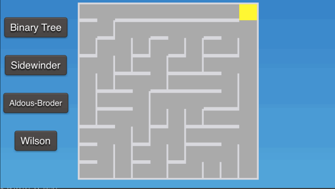
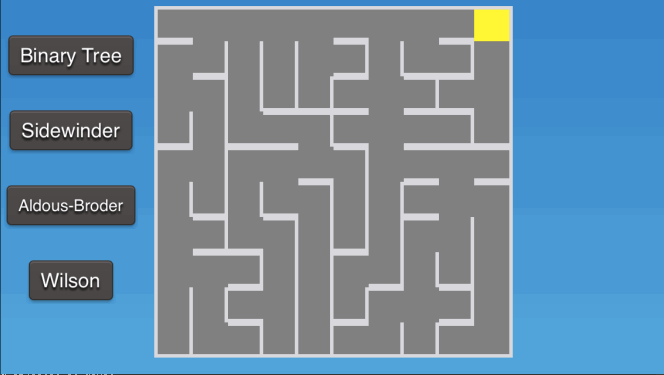
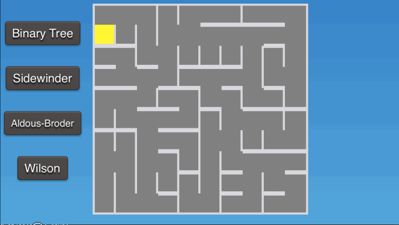
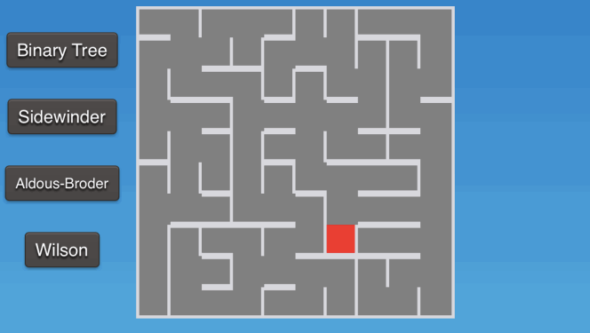

# mazes-swift

#Binary Tree
1. Visit each cell once
2. Flip a coin
  - Heads: Connect the north wall if possible
  - Tails: Connect the east wall if possible
  
Result:

#Sidewinder
1. Perform 2 and 3 on each row
2. Visit each cell in row
3. Flip a coin at each cell
  - Heads: Connect the east wall and remember the cell
  - Tails: Choose one of the cells you remembered and connect the north wall, forget the remembered cells

Result:

#Aldous-Broder
1. Remember the number of unvisited cells
2. Pick a cell at random and visit it
3. Repeat 4 to 6 while there are unvisited cells
4. Pick a random valid direction to move
5. If the cell was not visited
  - Visit the cell
  - Connect the current cell to the new cell
6. Move to the new cell

Result:

#Wilson
1. Remember the number of unvisited cells
2. Pick a random cell and visit it
3. Repeat 4 to 11 while there are unvisited cells
4. Pick a random unvisited cell to start walk
5. Repeat 6 to 9 while the walk hasn't encountered an unvisited cell
6. Pick a random valid direction to walk in
7. Move to cell
8. If cell is already part of walk
  - Forget all cells after original visit to cell
9. Else add cell to walk
10. Connect cells accumulated during walk
11. Forget walk

Result:

